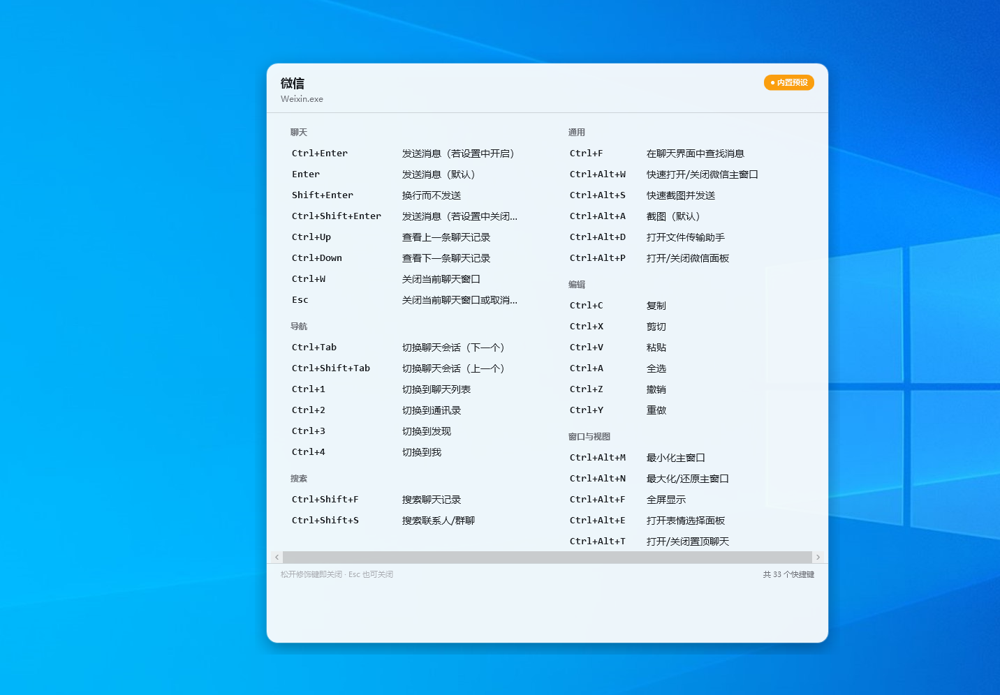

# KeyPeeker
<p align="center">
  
</p>


在任何应用里按一下，弹出**当前应用的快捷键列表**——类 macOS CheatSheet，Windows 原生实现。

## 它是怎么工作的

1. 全局监听键盘（低级钩子，只监听、不吞键）。
2. 触发后读取**当前前台窗口**，收集快捷键（按优先级尝试，全自动无配置）：
   1. **Win32 菜单实时读取**（非侵入）：`GetMenu` 枚举真实菜单 + 读取 exe 内嵌**加速键表**（RT_ACCELERATOR）按命令 ID 对应回菜单项 —— 记事本这类"快捷键写在加速键表里、菜单文本不显示"的程序也能拿到真实的 Ctrl+N / Ctrl+S；
   2. **UI Automation 实时扫描**（非侵入，500ms 超时保护）：对以 UIA 暴露菜单的程序有效；
   3. **侵入式激活扫描**（可选）：轻点 Alt 激活菜单后读取，`config.json` 中 `popup.allowInvasiveScan` 开启（默认关；实测对 Ribbon 类应用无效，仅供个别动态菜单老程序）；
   4. **内置预设回退**：按进程名匹配 `%APPDATA%\KeyPeeker\presets\*.json`（手工维护，可自行增改），覆盖 Ribbon/自定义 UI 类应用（如文件资源管理器）；
   5. 都没有 → 弹窗显示"无数据"并引导建预设。
3. 在屏幕正中弹出无边框、**不抢焦点**的 Apple 风格多列面板，按分类整组排列、尽量免翻页；Esc、松开修饰键或再次触发即关闭。

> 已知边界：Windows 应用菜单结构不统一，**没有任何工具能凭空读出任意应用的快捷键**。
> KeyPeeker 的“实时读取”只对带标准 Win32 菜单的应用有效；其余靠预设表。
> 对以管理员身份运行的窗口，因 UIPI 保护可能读取失败（会回退预设/提示无数据）。

## 默认触发方式

| 方式 | 操作 |
|---|---|
| 长按弹出（默认开启） | 按住 `Ctrl` 约 0.55 秒（期间没按其它键）→ 弹出；**松开即关** |
| 热键开关（默认开启） | `Ctrl+Shift+F1` 显示/隐藏；`Esc` 关闭；空闲 20 秒自动关 |

两者都可在 `%APPDATA%\KeyPeeker\config.json` 中修改（热键、长按阈值、修饰键、弹窗尺寸、透明度等）。

## 托盘菜单

- 查看当前应用快捷键（等效热键）
- 为当前应用创建预设模板（自动生成 JSON 并定位到文件）
- **设置…**：DeepSeek API Key / 模型、**AI 补齐**、自定义触发按键（长按修饰键+毫秒、组合热键）、**开机自启**
- 打开预设目录 / 打开配置文件
- 退出

### 设置项说明

| 设置 | 说明 |
|---|---|
| DeepSeek API Key | 用于“AI 补齐”；Key 明文存于本机 `%APPDATA%\KeyPeeker\config.json` |
| 模型 / API 地址 | 默认 `deepseek-chat` / 官方地址，可改 |
| **AI 补齐当前软件快捷键** | 输入进程名（或点“取当前前台应用”）→ 点按钮生成；结果在设置内**明确显示 ✅ 添加成功（已写入 xxx.json，共 N 个快捷键）或 ❌ 添加失败（原因）**，成功后列表立即弹出 |
| 长按修饰键 + 毫秒 | 默认 Ctrl + 550ms，可换 Alt/Shift/Win 或左右侧精确键 |
| 组合热键 | 默认 Ctrl+Shift+F1，可勾选修饰键组合 + F1~F12 / A~Z |
| 开机自动启动 | 写入当前用户 HKCU Run 键，登录后自动驻留托盘 |

### DeepSeek AI 补齐流程

1. 托盘 → 设置 → ① 填入 DeepSeek API Key → 点“保存”；
2. 设置窗口 ② 区：点“取当前前台应用”自动填入，或手动输入进程名；
3. 点“让 DeepSeek 生成并安装该软件的快捷键”→ 状态文字实时显示进度；
4. 完成时：**成功**显示绿色“✅ 添加成功：已写入 xxx.json（N 个快捷键）”，并把列表立刻弹给你；**失败**显示红色原因（无 Key / 网络 / JSON 无效等），可修正后重试；
5. 之后在该软件里触发就直接显示 AI 生成的列表（可再手动改 JSON）。

## 构建与运行

需要 .NET 9 SDK（本机已装）：

```powershell
dotnet build   # 或 dotnet run --project src/KeyPeeker
```

运行后程序驻留系统托盘。触发一次试试（在记事本里按住 Ctrl）：

## 命令行诊断（无需 GUI）

用于开发验证：不弹窗，直接打印当前前台窗口（或指定进程）能被读到的快捷键。

```powershell
dotnet run --project src/KeyPeeker -- --diag          # 打印当前前台窗口
dotnet run --project src/KeyPeeker -- --diag notepad  # 打印正在运行的记事本
dotnet run --project src/KeyPeeker -- --diag notepad --accel  # 附带打印加速键表原始映射
dotnet run --project src/KeyPeeker -- --datadir D:\tmp --diag  # 用自定义数据目录
```

报告同时写入 `{数据目录}\diag-last.txt`，方便在无控制台环境下取回。
运行期关键事件记录在 `{数据目录}\startup.log`（数据目录就绪前写 `%TEMP%\KeyPeeker-startup.log`）。

## 目录结构

```
快捷键app/
├─ KeyPeeker.sln
├─ README.md
└─ src/KeyPeeker/
   ├─ App.xaml(.cs)          # 入口、触发状态机、托盘
   ├─ DiagRunner.cs          # --diag 诊断模式
   ├─ Core/
   │  ├─ NativeMethods.cs    # Win32 P/Invoke
   │  ├─ KeyNames.cs         # 键码与配置名互转
   │  ├─ Win32MenuReader.cs  # 实时读取真实菜单（核心）
   │  ├─ PresetStore.cs      # JSON 预设存取
   │  ├─ ShortcutAggregator.cs # 前台窗口 → 快捷键集合
   │  ├─ KeyboardHook.cs     # 全局低级键盘钩子
   │  ├─ AppConfig.cs / AppPaths.cs / ShortcutModels.cs
   ├─ UI/
   │  ├─ OverlayWindow.cs    # 悬浮面板
   │  └─ TrayIcon.cs         # 托盘
   └─ Presets/               # 内置预设（explorer/notepad）
```

## 如何给新软件添加预设

1. 切到该软件，托盘 → “为当前应用创建预设模板”（或直接在预设目录新建 `进程名.json`）；
2. 参考 `Presets/README.md` 与 `Presets/explorer.json` 填写分组与快捷键；
3. 保存后重新触发即生效。

## 开源许可与免责

- **许可协议**：MIT（见仓库根目录 `LICENSE`）。可自由使用、修改、分发（含商用），需保留版权声明。
- **免责声明**：本工具通过 DeepSeek 官方 API 的“AI 补齐”功能由使用者自行填写 Key 并保存在本机（明文），该功能会产生 **API 费用**，请自行控制调用量。工具不联网采集用户数据，所有配置/预设/改键记录仅存储在本机 `%APPDATA%\KeyPeeker`。
- 本软件按“现状”提供，作者不对使用过程中产生的任何问题承担责任。
